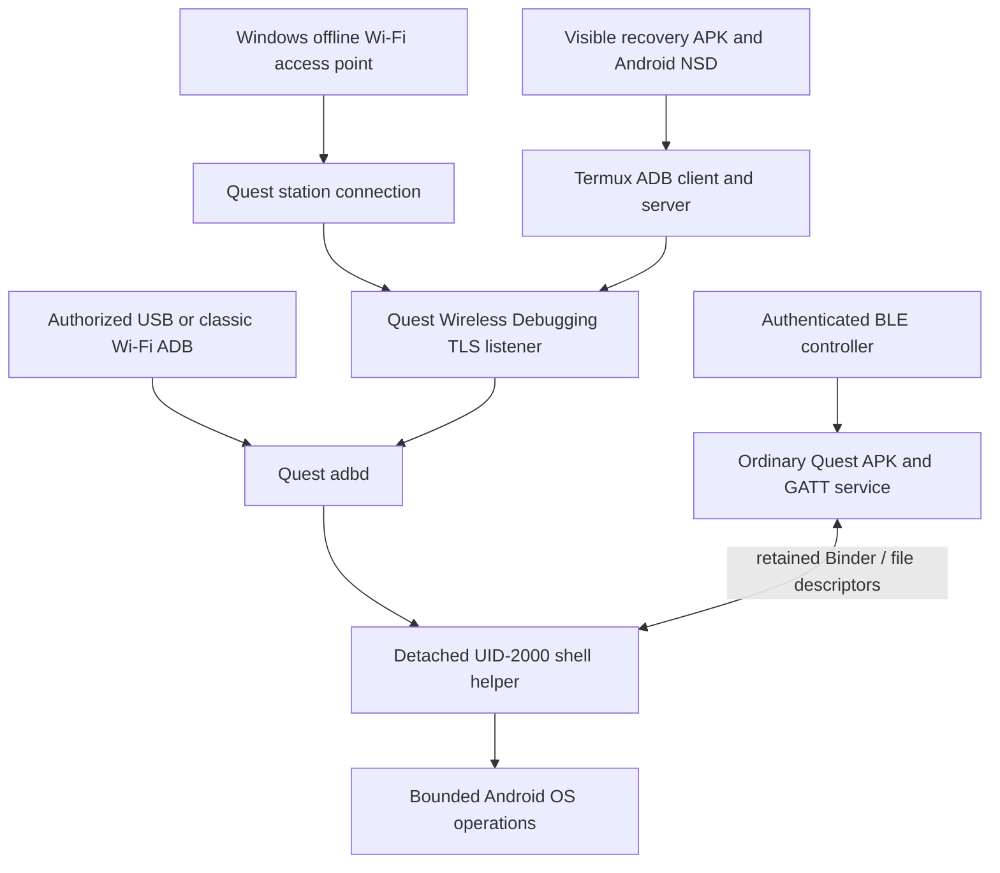

# Quest offline hotspot, elevated shell, and Bluetooth handoff

Prepared 12 September 2026 for a collaborator and their development agent.
The live findings below are from attended Quest Android 14/API 34 experiments,
including a Quest 3S. They describe tested diagnostic implementations and
specific observed limits. Source publication does not make these components a
released Rusty Morphospace product feature.

## What was achieved

Three capabilities now have separate, positive evidence:

1. **A Windows-hosted Wi-Fi network without Internet sharing.** The Quest joined
   it as a normal station, communicated locally with Windows, and obtained a
   headset-local Termux TLS ADB shell after the wearer accepted Meta's network
   approval. A guardian automatically returned the Quest to its original
   network. The corrected Windows controller also passed explicit Stop before
   its timeout and removed its owned host resources.
2. **An ordinary APK communicating with an existing Android shell process.**
   An authorized ADB connection launched a detached UID-2000 helper. Binder
   passed typed requests and file descriptors between the APK and helper.
   Following a separate Termux TLS launch, this local connection and exact
   4 KiB/4 MiB transfers in both directions survived loss of Wi-Fi and TLS.
   That continuity experiment retained USB for observation and controller
   dispatch; the no-USB claim belongs to the BLE experiment below.
3. **Bluetooth control after USB removal and Wi-Fi loss.** With USB already
   disconnected, classic Wi-Fi ADB launched the helper. Signed BLE commands
   crossed the ordinary APK and its Binder connection, disabled Wi-Fi, and
   restored it after a measured 10.016-second interval. Five connection probes
   to the Wi-Fi ADB endpoint timed out while BLE stayed connected. The same
   UID-2000 process handled restoration and then stopped normally.

The central distinction is **startup versus continued operation**. ADB creates
the shell process with shell authority. The app can retain a local connection
to that process and use Bluetooth for subsequent control. Bluetooth does not
create a new shell after a reboot.

## Source map and reading order

These links are pinned to the published source revisions for this handoff.
Read the repository's own `AGENTS.md` before changing its code. Do not assume
that a later `main` contains exactly the same implementation.

| Repository / revision | Start here | Purpose |
| --- | --- | --- |
| `MesmerPrism/meta-quest-agent-workflow` | This document; [APK-to-shell playbook](apk-shell-capability-playbook.md); [Termux sidecars](termux-linux-sidecars.md) | Reusable operational procedure, evidence, and limits; canonical `meta-quest-workflow` skill |
| `MesmerPrism/rusty-hostess` at `208e33a84d9c0ff2ec6caf8be9e87263e6dd9b19` | [Windows provider](https://github.com/MesmerPrism/rusty-hostess/tree/208e33a84d9c0ff2ec6caf8be9e87263e6dd9b19/tools/connectivity_probe/b11_wifi_direct_legacy_go) | Windows autonomous Wi-Fi Direct group owner, local nonce listener, isolation observations, Status/Stop and cleanup |
| `MesmerPrism/rusty-quest` at `03b5f2a46c89ff9ba3fc38b429fc620e7ba4a2bd` | [Shell/APK diagnostic](https://github.com/MesmerPrism/rusty-quest/tree/03b5f2a46c89ff9ba3fc38b429fc620e7ba4a2bd/tools/diagnostics/quest-shell-capabilities); [offline handoff](https://github.com/MesmerPrism/rusty-quest/tree/03b5f2a46c89ff9ba3fc38b429fc620e7ba4a2bd/tools/diagnostics/quest-offline-hotspot-handoff) | Android shell attribution, APK/Binder/FD/BLE code, Wi-Fi radio commands, temporary-network handoff and guardians |
| `MesmerPrism/quest-termux-lab` at `3701e821bfe8e7b7e4759904cf5b77d079df1075` | [Recovery helper](https://github.com/MesmerPrism/quest-termux-lab/tree/3701e821bfe8e7b7e4759904cf5b77d079df1075/examples/wireless-adb-recovery-helper); [results](https://github.com/MesmerPrism/quest-termux-lab/blob/3701e821bfe8e7b7e4759904cf5b77d079df1075/docs/QUEST_RESULTS_PUBLIC.md) | On-headset ADB client, Android NSD discovery, visible recovery/pairing flow, topology probes, and lab results |

Use `git clone` for the selected owner and `git checkout <full revision>` to
inspect this snapshot. Build outputs, signing keys, pairing records, network
credentials, raw device logs, and machine-specific scripts are deliberately
absent from the published sources. Generate new run credentials and build
artifacts locally. The source READMEs give the build and invocation contracts;
the summaries below explain how those contracts fit together.

## Components and connections

The two bootstrap routes in the diagram were tested in separate runs. The
offline hotspot/TLS test retained USB for observation and recovery. The final
no-USB BLE test used classic Wi-Fi ADB for startup. A single experiment combining
offline-hotspot Termux TLS startup, USB absence, and the BLE radio cycle has not
been claimed.

| Component | What it contributes | What it does not grant |
| --- | --- | --- |
| Windows administrator token | Privileged host sharing inspection and a scoped temporary firewall rule | Android shell or root authority |
| Windows Wi-Fi Direct group owner | An external access point and a local network usable without Internet | ADB authentication or Quest shell permission |
| Termux | A normal Android environment running the ADB client/server with its own approved key | Shell UID merely by being installed |
| Recovery APK | Visible recovery, dynamic service discovery, fixed Termux dispatch, bounded status | Protected-prompt bypass or a general command service |
| Quest `adbd` | Executes an authorized startup request with Android shell identity | Root or blanket permission to call every Android API |
| Detached shell helper | Retains UID 2000 and exposes the tested typed operations | Guaranteed survival of reboot, daemon restart, eviction or sleep |
| Ordinary diagnostic APK | Holds the Binder connection and handles Android BLE APIs under its app UID | Inheritance of UID 2000 |
| BLE controller | Authenticated low-rate requests and replies while Wi-Fi is unavailable | ADB transport or fresh post-reboot elevation |
| Restore guardian | A bounded fallback that restores the owned Wi-Fi state | A persistent service or proof of daemon-restart survival |

Android's [ADB documentation](https://developer.android.com/tools/adb) explains
the client/server/device-daemon split. Here the client and its server can run
inside Termux on the same headset as the device daemon. Keep this topology
distinct from a Windows-hosted ADB server and from the APK's Binder channel.

## How the offline Windows hotspot works

The host implementation uses `Windows.Devices.WiFiDirect` with autonomous group
owner enabled and legacy access-point settings. It advertises a generated SSID
and WPA2 passphrase that a normal Wi-Fi station can join. Microsoft documents
the [autonomous group-owner switch](https://learn.microsoft.com/en-us/uwp/api/windows.devices.wifidirect.wifidirectadvertisement.isautonomousgroupownerenabled)
and provides a [legacy access-point sample](https://github.com/microsoft/Windows-classic-samples/tree/main/Samples/WiFiDirectLegacyAP).
The implementation and test establish the actual behavior on the inspected
Windows adapter; these API references alone do not guarantee driver support.

The host retained its normal upstream Wi-Fi association while the separate
Wi-Fi Direct network served the Quest. The provider verified that Internet
Connection Sharing and relevant forwarding were disabled. A listener bound to
the group-owner interface supplied an exact nonce exchange, proving local
connectivity independently of Internet access. The elevation wrapper verified
the expected EXE and DLL hashes, created one run-owned firewall rule for the
local health endpoint, and removed that rule in `finally`.

External IPv4 and IPv6 HTTP controls succeeded on the original Quest network,
failed on the temporary network, and succeeded again after restoration. Local
nonce traffic and the Termux TLS shell succeeded on the temporary network.
This is the evidence for a useful local network without Internet sharing. It
is not an exhaustive network-isolation or firewall certification.

The Windows provider's `Program.cs` contains the advertisement, request
validation, status/control loop, lifecycle and cleanup. `Invoke-Elevated.ps1`
contains the hash checks and temporary firewall-rule wrapper. Read the
provider's [focused guide](https://github.com/MesmerPrism/rusty-hostess/blob/208e33a84d9c0ff2ec6caf8be9e87263e6dd9b19/docs/WINDOWS_LOCAL_ONLY_WIFI_DIRECT_GO.md)
for the current request schema and the standard-user Status
and Stop commands; do not substitute Windows Mobile Hotspot/ICS commands or
invent request fields from this summary.

### Returning the Quest to its original network

The separate Quest `quest-offline-hotspot-handoff` diagnostic is a UID-2000
`app_process` program. Its fixed modes include `snapshot`, `connect`, `restore`,
`guard`, and a non-mutating watchdog probe.

It records original network A, requires a fresh temporary network B, starts a
separate guardian before the handoff, stores B's returned network ID immediately
after addition, and binds the Android-normalized profile. It selects B and
requires current-network and IP-address readback. Restoration selects A,
checks the original association, removes only the recorded B profile, and
verifies the original saved-network inventory.

In the accepted automatic restoration window, the configured monotonic
deadline caused the guardian to restore A without a USB recovery command.
The daemon identity was unchanged. Configure ADB transports before arming
this guardian: separate observations showed that ADB reconfiguration can kill
detached shell work.

### The Windows Stop defect and repair

An early elevated named-pipe approach failed across different token-owner
SIDs. The implemented route uses a private run-directory control exchange.
Its first live Stop attempt exposed a real race: the writer made the final
request filename visible while still holding the file exclusively; the reader
could hit sharing violation `0x80070020` and fault. The unsupervised control
task then stopped updating status while the hotspot continued to its timeout.

The correction writes and closes a temporary file before atomic publication,
permits replacement-compatible reads, retries transient I/O within a bound,
and supervises control-task failure. Seventeen tests exercised the actual
production loop, including contention. A subsequent host-only run completed
twelve Status calls and consumed explicit Stop roughly 160 seconds before
timeout, then removed its owned processes, listener, rule, and control files.
The corrected host was retested for these changed functions; the earlier Quest
association and TLS evidence belongs to its earlier frozen host build.

## Getting the on-headset TLS shell

The Termux recovery helper uses a normal Android foreground service and
Android NSD to discover `_adb-tls-connect._tcp`. It sends a fixed embedded
Python payload through Termux's permission-gated `RunCommandService`. The
Termux ADB client connects to the currently discovered loopback TLS port and
requires an exact `uid=2000(shell)` result.

The tested Termux Android Tools package supported direct TLS/RSA connections
but lacked ADB-host mDNS discovery. Android NSD supplied the missing discovery
step. A discovered endpoint alone is insufficient: stale NSD callbacks were
observed after network transitions. Also, `service.adb.tls.port` could be blank
while a real TLS listener and shell connection worked. Use current listener
evidence, a fresh connection, and shell identity to judge availability.

One-time prerequisites include Termux with `python` and `android-tools`,
`allow-external-apps=true`, the helper's declared grants, and physical approval
of the Termux client's own key. No Windows private ADB key was copied to the
headset. The visible helper's **Restore Now** flow can request Wireless
Debugging; the wearer must accept Meta's protected approval when it appears.
On the tested Horizon build, the standard Android pairing-code settings screen
was unavailable; Meta network/key authorization supplied the attended path.

Relevant implementation files under the recovery helper are `RecoveryService.java`
(NSD and dispatch), `RecoveryResultService.java` (returned status),
`MainActivity.java` (visible operator controls), `BootReceiver.java`,
`LoopbackAdbProofProvider.java`, `TopologyProbeService.java`, and
`assets/wireless_adb_recovery.py`. Fleet-related status/restart paths exist in
this lab; Fleet is not required for the shell or BLE capability tests.

Classic TCP ADB and modern TLS Wireless Debugging remain separate routes.
Classic TCP uses an explicitly enabled configured port; modern TLS uses its
current dynamic connect port and approved client identity. The recovery payload
does not silently replace a missing TLS endpoint with classic TCP.

### Why successful startup did not imply persistent TLS

During the offline hotspot session, a later network-disconnect event caused
Android to disable Wireless Debugging and remove the TLS listener while
`adbd` remained alive. The Quest subsequently associated with the same hosted
network. The underlying transient disconnect cause was not established.

That result motivated retaining a shell process and Binder connection after
startup. A lost listener can block new ADB sessions without necessarily killing
an already-running helper. In the separate TLS continuity test, classic TCP was
disabled before helper creation; a Termux TLS request launched the helper.
After Wi-Fi and TLS went away, the ordinary APK completed Binder STATUS and
4 KiB/4 MiB pipe transfers in both directions with exact hashes. USB remained
connected as observer/controller; the host used a `run-as` client dispatch
to the existing normal Termux ADB server. Those details
limit the claim without changing which transport actually created the helper.

## The APK-to-shell interface

The working design uses `app_process` for the shell-side Java entry point,
with correct shell package attribution where Android framework calls require
it. The shell obtains the diagnostic app's exported ContentProvider through
`IActivityManager.getContentProviderExternal`, transfers a Binder object, and
releases the external-provider reference. The app retains the Binder separately.
The provider and helper check the intended UID, run token and lifetime; callback
identity is observed on the receiving side rather than assumed from the caller.

In `quest-shell-capabilities`, the important files are:

| File | Responsibility |
| --- | --- |
| `CapabilityProvider.java` | Exported bootstrap, caller checks and Binder handoff |
| `CapabilityActivity.java`, `CapabilityRuntime.java` | App-side typed actions, retained references, status and local post-drop probe |
| `ShellRole.java`, `ProbeCore.java`, `AppSnapshot.java` | Identity/attribution and bounded socket/API diagnostics |
| `LeaseShellRole.java`, `BinderProtocol.java` | Retained Binder lease, status/stop, fixed pipe transfers and death/lifetime handling |
| `WifiShellRole.java` | Fixed radio operations under UID 2000, authenticated callback admission and effective-state checks |
| `WifiRestoreGuardian.java` | Token-bound bounded Wi-Fi restoration fallback |
| `BleRuntime.java`, `BleProtocol.java`, `BleProtocolTest.java` | APK GATT service, framing, authentication, sequence checks and protocol tests |
| `ble_wifi_client.py` | Portable host client for the fixed authenticated BLE test sequence; no ADB command or profile API |
| `Build.ps1`, `Build-Shell.ps1` | APK and shell-only build lanes with artifact receipts |

The ordinary app remains an ordinary app; shell authority stays in the helper.
Loopback TCP worked in the bounded diagnostics. The proposed app-to-shell
abstract Unix socket did not: SELinux denied the cross-domain connection.
Binder and descriptor transfer worked, so the implementation used those real
interfaces instead of trying to infer that all local IPC is allowed.

For potential streaming integration, the Binder-carried pipes prove local byte
transfer and integrity at the tested sizes. They are not throughput, latency,
codec, compositor, audio, or complete media-pipeline measurements. Keep bulk
media on dedicated descriptors/transports and low-rate commands on a bounded
control interface. In Rusty Morphospace, Rusty Quest owns the Android adapter
and lifecycle; Manifold retains accepted command/session/stream authority.

## The tested Bluetooth protocol and no-USB sequence

BLE terminates in the APK's Android GATT service. The app then calls the
retained Binder; `WifiShellRole` executes only the fixed tested radio commands
and checks their effective state before acknowledgement.

The service, RX and TX UUID prefixes are `b11c0001`, `b11c0002`, `b11c0003`,
with common suffix `-7a2b-4c3d-9e0f-112233445566`. Frames are exactly 20 bytes:
version, operation/outcome, big-endian 16-bit sequence, and a 16-byte truncated
HMAC-SHA256. The MAC covers direction (`C`/`R`), the raw 16-byte run token and
the four-byte header. READY is signed at sequence zero. Requests are NOOP=1,
WIFI_OFF=2 and WIFI_RESUME=3. The host used acknowledged RX writes followed by
uncached TX reads; TX notifications were not qualified.

Each run gets a new token and 32-byte key. An advertisement match alone is not
target authentication. Authenticate the signed READY before mutation, reject
bad MACs and replay, and do not move to another device after admitting a run.
The diagnostic takes a maximum 120-second helper lifetime and arms a separate
30-second restore guardian before OFF. This is diagnostic protocol evidence,
not a completed production enrollment or long-lived key-management design.
The diagnostic supplies its ephemeral key as a process argument, visible to
actors with sufficient local process visibility. A product needs a deliberate
credential-storage and enrollment design. The portable published host client
was derived from the retained test interface and passed source/protocol checks;
the original private host runner supplied the live evidence described here.

The successful no-USB sequence was:

1. Establish authorized classic Wi-Fi ADB and verify the target. Unplug USB
   before starting the helper. Record both host transport discovery and Android
   USB disconnected/unconfigured state.
2. Launch the detached helper over that Wi-Fi endpoint. Start the ordinary APK
   and wait for its actual service-added and advertising-ready callbacks.
3. Authenticate READY, reject a bad MAC, accept NOOP, and reject replay.
4. Send OFF. After the signed effective-state reply, keep BLE connected through
   the observation interval and sample the Wi-Fi ADB endpoint's unreachability.
5. Send RESUME over the same BLE connection. Verify the original association,
   identical helper PID/start time and UID, unchanged boot/daemon identity,
   exact saved profiles, and continuing USB disconnection after recovery.
6. Stop the helper and app, reconcile device state, and remove only run-owned
   staging and test installations.

The measured observation interval was 10.016 seconds with five failed TCP
probes. `adbd` stayed running. USB was connected again several minutes after
the completed run; that later physical action did not supply recovery during
the accepted cycle.

## Reboot and access-point-free limits

A Windows offline hotspot is still an external access point. The headset can
also create a peerless Wi-Fi Direct group or `LocalOnlyHotspot`, but neither
self-hosted topology satisfied the inspected Quest Wireless Debugging network
gate. The framework required a suitable station Wi-Fi connection; attempts
reset the setting and did not produce a usable TLS listener.

The reported [Android 16 phone UI race](https://github.com/thedjchi/Shizuku/issues/165)
remains a version-specific lead. Two bounded orderings on Quest Android 14 were
negative. This does not prove every timing workaround impossible; it supplies
no validated Quest bootstrap route. The inspected Meta companion Bluetooth
controls could request debugging modes but did not establish ADB-over-BLE or
fresh shell authority without the network gate.

After reboot, expect attended recovery through an eligible Wi-Fi network or
authorized USB. Stored ADB trust is useful but does not ensure that a listener
is running. Normal app startup, Bluetooth availability, root, and shell access
must not be treated as interchangeable capabilities.

## What caused the earlier stall

The original investigation mixed platform diagnosis, protocol development,
host orchestration and evidence tooling before proving the smallest real
interfaces. Several failures were in the agent-built harness rather than the
requested Quest behavior:

- Reflection asked for `NETWORK_SELECTION_ENABLE`, a diagnostic label, instead
  of the real `DISABLED_NONE` reason constant. A target read-only bootstrap
  confirmed the actual fields and accessors. The original failure was not
  evidence of missing shell privilege.
- The abstract Unix socket route had a real SELinux denial. Binder supplied a
  tested alternative; generic local-socket assumptions were inadequate.
- Host code rejected legitimate process/CRLF/discovery cases, and some mocks
  reproduced invented interfaces instead of the existing runtime protocol.
- The Windows Stop test initially mocked away the production file reader and
  missed its sharing race. Testing that actual reader exposed and fixed it.
- Meta dialogs could prevent app placement even with ADB connected and the
  display awake. App-owned GATT readiness became the acceptance condition.
- The final no-USB run suffered one pre-authentication Windows BLE failure and
  a false aggregate failure after the successful cycle: CRLF command output
  was compared with LF-normalized saved text. The original failed receipt was
  kept; raw inventories were byte-identical and the accepted behavior was
  independently reverified without another radio cycle.

The productive correction was to verify the target API read-only, reuse the
actual interfaces, complete one bounded behavior sequence, and audit its raw
evidence. Increased test counts or repeated review cycles were not substitutes
for new observed behavior.

## Instructions for the receiving agent

Read the source map and each focused README first. Start with the tested
diagnostics, not a new general-purpose shell protocol. For a new machine,
resolve its SDK/JDK, Windows adapter, ports, output directories and coordination
mechanism locally. Keep build, host-only tests, device effects and publication
claims separate.

For live reproduction, obtain a specific target and an available wearer,
capture the original network/settings/packages/transports, and establish USB
recovery before the first mutation experiment. Finalize ADB configuration before
arming guardians. Prove identity and readiness with a read-only command first.
Then reproduce the Windows host lifecycle, the guarded A→B→A handoff, TLS
startup, and BLE radio cycle as individually bounded tests. Remove USB only for
the specifically planned no-USB sequence after a working recovery path and
watchdog are established.

Do not retry a completed radio effect merely because a host parser failed.
Preserve raw receipts, distinguish transport loss from helper death, and check
effective Wi-Fi state and exact process identity. Preserve unrelated apps,
network profiles, keys and other agents' transports. If a protected prompt
blocks the run, request the wearer's action and keep the result pending.

The next engineering work is product integration and durability: defined
helper reacquisition after death, sleep/eviction behavior, long-session BLE
recovery, revocation and key storage, and measured media/FD integration. The
diagnostics intentionally do not answer those questions by assumption.

## Publication and validation status

The three implementation pull requests are merged into their repositories'
`main` branches. The source links above pin those observed merge commits;
their diagnostic runtime files match the published candidates. Merging does
not turn these lab diagnostics into a released product feature or add new
device evidence. The Windows snapshot passed its Release build
and 17 production-loop self-tests. The Termux snapshot passed its public
boundary check, compilation/parsing checks, and 16 recovery tests. The Quest
snapshot passed both focused source suites, its pure-Java BLE protocol test,
Python checks, source comparison and public-data scan. Android runtime inputs
were preserved from the tested implementation; no new device run was performed
for publication.

The broader Quest repository check reached an existing Rust formatting failure
in two Spatial Camera Panel files unchanged by this work. That repository-wide
gate is not reported as passing. It does not invalidate the separate focused
diagnostic or retained device evidence. The new workflow report and routing
updates pass the canonical workflow repository's required validation suite.

Private raw receipts remain with the experiment operator. Public documents
summarize their findings and limitations without publishing headset identifiers,
network credentials, ADB key material or captured device output. A collaborator
can reproduce the source and tests, but should not mistake this sanitized
handoff for possession of the original raw evidence bundle.

## Merged implementation revisions

| Component | Merged pull request | Commit on main |
| --- | --- | --- |
| MesmerPrism/rusty-hostess | [PR #33](https://github.com/MesmerPrism/rusty-hostess/pull/33) | `208e33a84d9c0ff2ec6caf8be9e87263e6dd9b19` |
| MesmerPrism/rusty-quest | [PR #80](https://github.com/MesmerPrism/rusty-quest/pull/80) | `03b5f2a46c89ff9ba3fc38b429fc620e7ba4a2bd` |
| MesmerPrism/quest-termux-lab | [PR #8](https://github.com/MesmerPrism/quest-termux-lab/pull/8) | `3701e821bfe8e7b7e4759904cf5b77d079df1075` |

Merge status and source ancestry were checked against GitHub and each remote
`main`. The original candidate checks and retained device results remain
separate from merge acceptance and any subsequent main-branch checks.

Fresh Static admission checks passed for the exact Quest and Hostess candidates
before ordinary merge commits were made; Quest required this check through its
branch rules. All three Termux candidate jobs passed. The Quest supplementary
formatting failure described above was
retained; it was not a required merge check, and the failing files are unchanged
from its base. No force push or administrator merge bypass was used.

The workflow documentation and this handoff are tracked in
[workflow PR #12](https://github.com/MesmerPrism/meta-quest-agent-workflow/pull/12).
